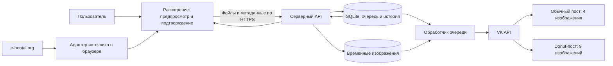

# Техническое задание: E-Hentai → ВК

Версия: 1.0.
Статус: пользовательские требования согласованы; технические решения и значения по умолчанию определены для реализации. Проверки внешних интеграций выполняются первым этапом разработки.
Дата: 7 октября 2026 года.

## 1. Цель

Создать браузерное расширение и серверное приложение в Docker, которые помогают владельцу сообщества ВК подготовить из выбранной галереи e-hentai.org пару публикаций:

- обычный пост с 4 случайными изображениями;
- пост для подписчиков VK Donut того же сообщества с 9 другими случайными изображениями.

Документ определяет состав первой версии, архитектуру, правила обработки, поставку и критерии приёмки. Подтверждённые пользователем требования приведены в разделе 2; остальные проектные решения выбраны с учётом личного использования и ресурсов сервера. Приложение на этапе составления ТЗ не реализуется и не развёртывается.

## 2. Подтверждённые требования

| ID | Требование |
| --- | --- |
| R-01 | Источник галерей: только e-hentai.org. Пользователь имеет аккаунт. ExHentai не входит в первую версию. |
| R-02 | Из одной галереи подготавливаются два поста: 4 изображения в обычном и 9 в Donut. |
| R-03 | Изображения Donut-поста не пересекаются с изображениями обычного поста. |
| R-04 | До публикации пользователь видит предпросмотр обоих наборов. |
| R-05 | Пользователь может заменять выбранные изображения перед подтверждением. |
| R-06 | Отправка в очередь требует подтверждения пользователя. |
| R-07 | После подтверждения пара постов отправляется в очередь. |
| R-08 | Donut включён в целевом сообществе; пользователь обладает правами администратора. |
| R-09 | Итоговые проекты включают браузерное расширение и серверное приложение, развёртываемое в контейнере. |
| R-10 | Целевой браузер: Brave. |
| R-11 | Расширение предназначено для личного использования владельцем. |
| R-12 | Сервер: Ubuntu 26, Docker установлен; 1 vCPU, 2 ГБ DDR4, 40 ГБ NVMe SSD. Точный выпуск ОС и архитектура CPU пока неизвестны. |
| R-13 | Очередь публикуется по Минску в 08:00, 10:00, 12:00, 14:00, 16:00, 18:00, 20:00. Ночью новых слотов нет. |
| R-14 | Одна галерея образует одну пару постов. Обычный пост планируется в слот, Donut — через минуту. |
| R-15 | Случайный выбор выполняется из всех страниц галереи, включая обложку. |
| R-16 | Замена выбирает другую случайную картинку; ручной выбор страниц не требуется. |
| R-17 | Галерею с менее чем 13 изображениями нельзя отправить в очередь. |
| R-18 | Обычный текст содержит строки «Фэндом», «Персонаж», «Модель» с хештегами, каждую с новой строки. |
| R-19 | Donut-текст содержит тот же блок и нижнюю строку «⭐ Эксклюзивное продолжение для Донов.». |
| R-20 | Donut-пост всегда остаётся доступным только платным подписчикам; автоматического открытия всем нет. |
| R-21 | Поля заполняются автоматически из тегов галереи и редактируются в предпросмотре. Пустые строки пропускаются. |
| R-22 | Есть отдельный переключатель включения имени модели и возможность ручного ввода этого имени. |
| R-23 | Предпочтительны оригинальные файлы, если они доступны бесплатно. Расход GP запрещён: это последнее согласованное решение пользователя. |
| R-24 | Повторную галерею можно отправить только после предупреждения и отдельного подтверждения повтора. |
| R-25 | При сбое второго поста повторяется только незавершённый Donut-пост. После простоя незавершённые передачи получают будущие времена; принятые ВК посты не дублируются. |
| R-26 | Домен сервера: revoulce.ftp.sh. Пользователь его ещё не настраивал; HTTPS включается в работы по развёртыванию. |

## 3. Пользовательский сценарий

1. Пользователь открывает страницу галереи и запускает расширение.
2. Расширение получает сведения о галерее в браузере с существующей сессией E-Hentai, проверяет число страниц и историю отправок.
3. Система формирует два непересекающихся случайных набора: 4 и 9 изображений. Получает выбранные файлы, отдавая приоритет бесплатным оригиналам, и передаёт их серверу как черновик.
4. Сервер проверяет файлы и при необходимости готовит совместимую с ВК версию. Пользователь видит два будущих поста, итоговые изображения, тексты, номера страниц и отметки качества.
5. Пользователь заменяет отдельные изображения на другие случайные, редактирует поля текста и включает или исключает имя модели. Замена повторяет получение и проверку только нового файла.
6. Пользователь подтверждает пару постов.
7. Сервер принимает подготовленную пару в очередь и возвращает идентификатор и состояние задачи.
8. Сервер сразу передаёт пару в отложенные ВК: обычный пост в ближайший свободный слот, Donut — через минуту. ВК обеспечивает выход без работающего сервера.
9. Пользователь получает результат и ссылки на созданные посты.

Граница приёма в очередь: все 13 итоговых файлов уже сохранены на сервере, прошли проверку и показаны в предпросмотре. Подтверждение фиксирует версию набора, тексты и параметры доступа одной транзакцией. После статуса «В очереди» браузер можно закрыть: сервер выполняет задачу самостоятельно. До завершения подготовки браузер и необходимая исходная вкладка должны оставаться открытыми; прерывание не создаёт принятую задачу.

## 4. Архитектура



Расширение получает сведения и изображения через браузер с существующей сессией пользователя. Cookies и пароль E-Hentai не передаются серверу. Сервер хранит готовые файлы, очередь и авторизацию ВК; во время публикации повторного обращения к E-Hentai не требуется. Работоспособность получения оригиналов и необходимых разрешений проверяется на первом этапе.

### 4.1. Браузерное расширение

- Обнаружение поддерживаемой страницы галереи.
- Запуск подготовки пары постов.
- Предпросмотр обычного и Donut-набора с понятными подписями аудитории и счётчиками 4/4 и 9/9.
- Замена изображений с сохранением непересечения наборов.
- Подтверждение отправки в очередь.
- Отображение состояния задачи и ссылок на результат.
- Настройка подключения к личному серверу.
- Сохранение черновика, переключателя модели и состояния подготовки; восстановление после перезагрузки интерфейса.
- Очередь: ближайшие ориентировочные слоты, пауза/возобновление, отмена ещё не начатой пары, повтор незавершённой операции и просмотр ошибок.
- История: галерея, дата, результат каждого поста и ссылки на ВК.
- Русскоязычный интерфейс, явное разделение обычного и Donut-поста.

Целевой браузер — настольный Brave, актуальная стабильная версия на момент поставки. Формат расширения — Chromium Manifest V3. Совместимость проверяется в Brave, который поддерживает большинство Chromium-совместимых расширений.

Кнопка расширения на странице `/g/{id}/{token}/` открывает отдельную страницу расширения с предпросмотром 13 изображений. На ней же доступны очередь, история и настройки. Установка — распакованная сборка через режим разработчика Brave с отдельной инструкцией обновления.

Фоновый service worker обрабатывает короткие события. Длительная подготовка идёт через открытую страницу расширения с сохранением прогресса; фоновой памяти процесса недостаточно для хранения состояния. Скрипт страницы E-Hentai выполняет запросы в её контексте там, где это требуется сессией. Запросы к хостам изображений и серверу выполняются из доверенного контекста расширения с соответствующими разрешениями, а не предполагаемым обходом CORS в content script.

Разрешения: `storage`, `activeTab`, `scripting` и доступ к e-hentai.org и целевому серверу по необходимости выбранной реализации. Для хостов доставки изображений разрешения запрашиваются только на фактически требуемые адреса после проверки их происхождения. Чтение cookies отдельным API, постоянный доступ ко всем сайтам и удалённое выполнение кода не требуются; окончательный manifest фиксируется после проверки загрузки в Brave.

### 4.2. Серверное приложение

- API для расширения с проверкой доступа.
- Проверка параметров задачи независимо от проверок в расширении.
- Сохранение подготовленных изображений и метаданных задачи.
- Постоянное хранение очереди и результатов публикации.
- Обработчик очереди с восстановлением после перезапуска.
- Адаптер VK API для загрузки фотографий и создания постов.
- Учёт результатов каждого из двух постов отдельно.
- Обработка временных ошибок, ограничений запросов и ошибок авторизации.
- Удаление временных файлов по согласованному сроку хранения.
- Проверка работоспособности и журнал событий без секретов.

Для сервера с 1 vCPU и 2 ГБ памяти рекомендуется один контейнер приложения: API и обработчик очереди в одном процессе, SQLite для постоянного состояния и файловый каталог для изображений. Отдельная серверная БД и брокер очереди в базовой архитектуре не требуются. Это рекомендация по имеющимся ресурсам, а не результат измерения производительности.

### 4.3. Хранение

Основные сущности:

| Сущность | Основные сведения |
| --- | --- |
| Галерея | Нормализованный URL, идентификатор, токен галереи, название, число страниц, доступные метаданные. |
| Изображение | Галерея, номер страницы, идентификатор источника, локальный файл, формат, размеры, SHA-256. |
| Черновик пары | Два набора изображений, тексты, параметры аудитории, версия предпросмотра. |
| Задача пары | Идентификатор, согласованное время/место в очереди, зафиксированный черновик, состояние, попытки, ошибки. |
| Публикация | Вид поста, его состояние, идентификаторы фотографий ВК, ключ операции, идентификатор и URL поста. |
| Настройки | Целевое сообщество, параметры очереди, шаблоны и сроки хранения из раздела 13. |

Токены и другие секреты хранятся отдельно от публичных метаданных и не входят в ответы API, журналы или сборку расширения. Способ хранения описан в разделе 13.

### 4.4. Стек и развёртывание

| Компонент | Предлагаемое решение | Назначение |
| --- | --- | --- |
| Расширение | TypeScript, Manifest V3, Vite, HTML/CSS. | Предпросмотр, замены, подтверждение и управление задачами. |
| Приложение | TypeScript, Node.js 24 LTS, Fastify стабильной совместимой ветки. | Общие контракты, API, загрузка и планировщик. |
| Состояние | SQLite на локальном диске сервера. | Черновики, постоянная очередь и история. |
| Изображения | Файлы в постоянном Docker volume. | Подготовленные наборы для будущих публикаций. |
| Запуск | Docker Compose, один экземпляр приложения, автоматический перезапуск. | Развёртывание и восстановление процесса. |
| Доступ | revoulce.ftp.sh: HTTPS через существующий прокси либо Caddy 2. | Защищённое соединение расширения с сервером. |

Ограничения базовой архитектуры:

- Обрабатывается одна пара публикаций одновременно; сетевые загрузки также имеют ограниченную параллельность.
- Изображения передаются потоками и сохраняются на диск; вся галерея или архив не загружается в память.
- Получаются только нужные страницы и изображения, насколько это позволяет источник.
- Временные файлы, незавершённые черновики и журналы имеют ограниченный срок хранения и квоты; начальные значения указаны в разделе 13.
- Каталог данных сохраняется при замене контейнера. Бэкап включает согласованную копию SQLite, настройки и изображения активной очереди.
- До передачи задача сохраняется в БД; после передачи время выхода и посты находятся в отложенных ВК. Таймер сервера проверяет незавершённые передачи, а публикацию по времени выполняет ВК.

Проектный ориентир: оставить достаточно памяти и диска для Ubuntu, Docker и других служб. Точные лимиты контейнера и файлов проверяются на согласованном размере очереди; сам объём диска 40 ГБ не означает, что весь диск доступен приложению.

## 5. Выбор изображений и тексты

- Выбор без повторения одной и той же страницы внутри пары постов.
- При замене система исключает все 13 текущих страниц, включая заменяемую. Новый результат отличается от старого и от остальных выбранных изображений.
- Выборка строится из всех страниц галереи. Обложки и последние страницы не исключаются.
- После подтверждения состав наборов фиксируется; повторные попытки публикации используют тот же состав.
- При числе страниц меньше 13 подготовка и отправка запрещены с понятным объяснением.
- При ровно 13 доступных изображениях наборы создаются, но отдельная замена недоступна: свободной страницы нет. Автоматического изменения соседнего набора ради замены нет.
- Нельзя подтвердить пару с неуспешно загруженным или недопустимым файлом. Ошибка получения позволяет выбрать другую случайную доступную страницу без изменения уже подтверждённой очереди.
- При обнаружении одинаковых исходных файлов по SHA-256 выбирается другая страница. Если 13 уникальных доступных изображений собрать нельзя, отправка запрещается.
- Равномерный выбор выполняется по индексам всех страниц, а не только по первой странице миниатюр. Число миниатюр на странице определяется из фактической разметки.
- Внутри каждого поста изображения по умолчанию упорядочены по номеру страницы; предпросмотр отображает именно этот порядок.

### 5.1. Тексты

Обычный пост:

```text
Фэндом: #kill_la_kill
Персонаж: #ryuuko_matoi #nui_harime
Модель: #kate_sarkissian
```

Donut-пост:

```text
Фэндом: #kill_la_kill
Персонаж: #ryuuko_matoi #nui_harime
Модель: #kate_sarkissian
⭐ Эксклюзивное продолжение для Донов.
```

| Поле | Источник автоматического заполнения |
| --- | --- |
| Фэндом | Теги пространства `parody`. |
| Персонаж | Теги пространства `character`. |
| Модель | Теги пространства `cosplayer`. |

Все значения одного поля размещаются в одной строке через пробел. Пространства тегов соответствуют описанию EHWiki; сопоставление с русскими полями — решение этого проекта. `artist` не подменяет отсутствующую модель.

Нормализация хештегов: Unicode NFKC, нижний регистр, пробелы и недопустимые разделители заменяются на подчёркивание; повторяющиеся подчёркивания и дубли удаляются. Перевод и перестановка частей имени автоматически не выполняются. Пользователь редактирует итоговые значения перед подтверждением; допустимость хештегов проверяется при интеграции с ВК.

Для модели имеется переключатель «Включать модель», по умолчанию включённый и запоминаемый для следующих галерей, и редактируемое поле ручного имени. Выключенный переключатель исключает строку модели из обоих постов. Пустые поля не создают строк и пустых подписей. Если все поля пусты, обычный пост состоит только из изображений, а Donut содержит нижнюю строку.

В VK API передаётся обычный текст с переносами строк и хештегами, без Markdown-разметки из примера пользователя. Звезда передаётся символом `⭐`. Заголовок галереи и URL источника показываются в интерфейсе и истории; их автоматическое добавление в текст поста не требуется.

### 5.2. Оригиналы и расход GP

Согласованное правило: `gp_spending_allowed = false`. Бесплатный доступный оригинал предпочтителен; иначе используется полноразмерное изображение со страницы и в предпросмотре указывается тип полученного файла.

- До запроса оригинала адаптер проверяет, можно ли получить его без списания GP при фактических настройках аккаунта и доступной квоте.
- Если стоимость неясна либо отсутствие списания нельзя гарантировать, оригинал не запрашивается: используется изображение со страницы.
- Автоматическое приобретение квоты, архивов, сброс лимитов за GP и пополнение баланса не выполняются.
- Пользовательские ограничения сайта соблюдаются: ограничение параллельности, задержки и прекращение повторов при исчерпании лимита.
- Бесплатность загрузки оригинала и её влияние на квоту проверяются первым этапом разработки. При отсутствии надёжного способа определить стоимость бесплатный режим использует картинку со страницы и объясняет причину в предпросмотре.

Совместимый оригинал передаётся в ВК без дополнительного уменьшения приложением. Необходимое преобразование формата или уменьшение выполняется до окончательного подтверждения и отражается в предпросмотре. Качество результата зависит также от обработки фотографий самим ВК. Неподдерживаемая анимация не превращается незаметно в один кадр: файл требует замены.

## 6. Очередь, публикация и восстановление

Пара постов — одна пользовательская задача, но у каждого поста имеется собственное состояние. Общая атомарная публикация двух записей не предполагается.

- Повторное подтверждение одного и того же черновика должно возвращать ту же принятую задачу.
- Полученная задача сохраняется до успешного завершения или явного действия пользователя.
- Перезапуск контейнера не должен терять очередь и сведения об уже опубликованном посте.
- Временные ошибки обрабатываются повторными попытками с ограничением частоты.
- Истёкшая авторизация или ошибка доступа переводит задачу в состояние, требующее вмешательства.
- Неопределённый результат запроса на создание поста требует проверки результата; слепая повторная публикация недопустима.
- Если опубликован только один пост, система показывает частичный результат и не создаёт его заново при продолжении.

Порядок передачи: обычный пост, затем Donut. Время выхода различается на минуту: например, 18:00 и 18:01. Donut создаётся только после подтверждённого успеха обычного поста. Ошибка Donut не удаляет обычный пост и не создаёт его повторно. Подтверждённые публикации автоматически не удаляются при отмене оставшейся части задачи.

### 6.1. Расписание

Часовой пояс: `Europe/Minsk`. Ежедневные слоты обычного поста: **08:00, 10:00, 12:00, 14:00, 16:00, 18:00, 20:00**. Donut выходит через минуту. Максимум при отсутствии занятых минут и ошибок — 7 пар в сутки.

- После подтверждения сервер сразу загружает фотографии и создаёт отложенные посты ВК через `wall.post` с `publish_date`; ожидание времени выхода выполняет ВК.
- FIFO среди доступных задач; восстановление частичной пары имеет приоритет. Все готовые пары могут передаваться заранее, включая ночное время.
- Каждая новая пара занимает две разные минуты. Учитываются локальные операции и все посты из `wall.get(filter=postponed)`, включая добавленные вручную. При конфликте выбирается следующий свободный слот.
- Время назначается после загрузки фотографий и всегда остаётся будущим. Старые пропущенные времена не используются.
- Если обычный пост уже принят, повторяется только Donut. Исходная минута сохраняется, пока она доступна; иначе Donut получает следующий свободный слот с минутным сдвигом.
- Пауза останавливает новые передачи; принятые ВК посты продолжают выходить по расписанию даже при выключенном сервере. Снятие паузы сразу запускает передачу.
- Изменение расписания касается ещё не переданных задач. Уже переданные посты редактируются и отменяются в ВК.
- В БД сохраняются часовой пояс, расписание, UTC-время каждого поста и результат передачи. Серверный таймер раз в 15 секунд проверяет только незавершённые передачи и повторы, без ожидания слота публикации.

### 6.2. Состояния

| Объект | Состояния |
| --- | --- |
| Черновик | `preparing`, `ready`, `invalid`, `expired`, `confirmed`. |
| Пара | `queued`, `publishing`, `retry_wait`, `partial`, `needs_attention`, `scheduled`, `completed`, `cancelled`. |
| Пост | `pending`, `uploading`, `ready`, `sending`, `scheduled`, `posted`, `retry_wait`, `unknown`, `failed`. |

`scheduled` означает подтверждённую передачу в отложенные ВК, без проверки фактического выхода. `partial` означает, что обычный пост принят ВК, а Donut ещё не завершён. `unknown` означает, что запрос мог создать запись, но подтверждение не получено. Такие состояния отображаются явно, а не как успешная публикация пары.

### 6.3. Повторы и неопределённый результат

- Идентификаторы сохранённых фотографий, ключ операции и подтверждённый post ID сохраняются отдельно для каждого поста.
- Перед внешним запросом создания записи сохраняется журнал намерения с ключом, текстом и идентификаторами вложений; секреты в журнал не попадают.
- `guid` используется, если поддержка подтверждена проверкой VK API; собственная история остаётся необходимой независимо от него.
- При тайм-ауте создания поста и после прерывания состояния `sending` сначала выполняется сверка с ВК. Повтор разрешается лишь при надёжно установленном отсутствии созданной записи; при неопределённости задача требует вмешательства.
- Для временных ошибок подготовки/загрузки — до трёх попыток с задержками и ограничением частоты. Ошибка авторизации требует обновления токена; остальные задачи не отправляются с заведомо недействительной авторизацией.
- Если передача не завершена, временная ошибка повторяется не чаще раза в минуту; время выхода назначается в будущем разрешённом слоте. Ошибки, требующие ручного действия, показываются отдельно и не бесконечно блокируют готовые задачи.
- Ошибки файла или утрата принятого файла не приводят к незаметной случайной замене: требуется исправление и новый предпросмотр.

Повторная отправка галереи отличается от повторного подтверждения того же черновика: первая создаёт новую пару после специального подтверждения, второе возвращает существующую задачу.

## 7. Границы первой версии и проектные решения

| ID | Область | Решение |
| --- | --- | --- |
| D-01 | Пользователи и сообщества | Один владелец, одна настроенная группа. |
| D-02 | Интерфейсы | Страница расширения: подготовка, очередь, история, настройки. Отдельная веб-панель не входит в первую версию. |
| D-03 | Браузеры | Актуальный настольный Brave. Мобильные браузеры и отдельные сборки Firefox не входят в поставку. |
| D-04 | Источник | Только выбранные пользователем галереи e-hentai.org. Автоматический обход каталога, торренты и загрузка полных архивов не требуются. |
| D-05 | Публикация | Фото и согласованный текст от имени сообщества; два самостоятельных поста. |
| D-06 | Управление принятой парой | Просмотр, отмена ещё не начатой пары либо её неопубликованного остатка и продолжение незавершённой публикации. Изменение файлов и текста до начала публикации выполняется через отмену и новый подтверждённый черновик. Уже частично опубликованная пара автоматически не пересобирается. |
| D-07 | Оповещения | Состояние и ошибки в расширении; журнал сервера. Внешние мессенджеры и email не входят в первую версию. |
| D-08 | Нагрузка | До семи пар за обычный день, очередь с ограничением объёма диска. Число подготовленных заранее пар может быть больше. |
| D-09 | GP | Нулевой разрешённый расход; известный баланс 40 kGP не является разрешением расходовать его. |
| D-10 | Сервер | Точный выпуск Ubuntu 26, CPU, свободный диск, занятые порты и DNS проверяются при развёртывании. Эти проверки не требуют новых пользовательских требований. |

## 8. Проверки интеграций до основной реализации

1. Проверить поддерживаемую авторизацию ВК и достаточные права для загрузки фотографий, обычной публикации и Donut-публикации. Не считать токен сообщества достаточным без проверки: в опубликованной схеме `wall.post` указан пользовательский токен.
2. Проверить параметр постоянного платного доступа и результат публикации для выбранного сообщества. Конкретное значение `donut_paid_duration` фиксируется по актуальной официальной документации и результату интеграционной проверки; произвольный большой период не заменяет постоянную закрытость. При невозможности создать постоянный Donut-пост операция блокируется без перехода к обычному посту.
3. Проверить видимость Donut-поста и его вложений для администратора, дона и обычного подписчика; способ загрузки не должен отдельно раскрывать закрытый набор.
4. Проверить получение списка страниц и оригиналов e-hentai.org в браузере, использование текущей сессии, определение бесплатности без списания GP, ограничения и хосты доставки. Прямые URL не являются единственным источником данных принятой задачи.
5. Проверить возможности выбранного браузера и необходимые разрешения расширения.
6. Проверить восстановление после прерывания между двумя публикациями и возможность установить результат запроса при сетевом тайм-ауте.
7. Проверить DNS revoulce.ftp.sh, доступные порты и выпуск TLS-сертификата в согласованной конфигурации сервера.

Результат первого этапа — документ с проверенными возможностями, выбранным способом авторизации, поддержанными форматами/лимитами фотографий и окончательным manifest. Пока Donut-интеграция не подтверждена, интерфейс не заявляет, что постоянная закрытая публикация готова.

Живые публикации для проверок интеграций выполняются после отдельного согласования тестового сценария и места публикации. На этапе составления ТЗ обращения к пользовательскому аккаунту и публикации не требуются.

## 9. Состав окончательной поставки

- Исходный код расширения и воспроизводимая сборка.
- Устанавливаемый пакет расширения и инструкция установки для выбранного браузера.
- Исходный код серверного приложения и Dockerfile.
- Docker Compose и конфигурация HTTPS для revoulce.ftp.sh с учётом уже работающих служб сервера.
- Конфигурация запуска, пример переменных окружения без секретов и инструкция настройки ВК.
- Схема постоянного хранения и процедура обновления.
- Документация API и состояний задач.
- Инструкция по развёртыванию, резервному копированию и восстановлению.
- Журналы, проверка работоспособности и описание типовых ошибок.
- Проверки случайного выбора, разделения наборов, повторной отправки, восстановления очереди и частичного успеха.
- Сценарии приёмки расширения и интеграций.
- Пример настройки с согласованным расписанием, текстами, переключателем модели и запрещённым расходом GP.
- Результаты проверок интеграций и ограничений используемых API.

Рекомендуемые технологии описаны в разделе 4.4, параметры — в разделе 13, структура репозитория — в разделе 14. При сборке фиксируются стабильные версии зависимостей в lock-файле и версия/образ контейнера; prerelease-ветки не используются.

## 10. Критерии приёмки и проверки

- Для подходящей галереи пользователь видит ровно 4 изображения обычного поста и 9 Donut-поста.
- Наборы не пересекаются до и после замен.
- Без подтверждения пара не попадает в очередь.
- Подтверждение создаёт отслеживаемую задачу.
- Опубликованные изображения соответствуют подтверждённому предпросмотру.
- Donut-пост доступен только донам постоянно, а его текст заканчивается согласованной строкой.
- Принятая очередь и результаты сохраняются при перезапуске.
- Частичный успех виден пользователю и не приводит к повторному созданию уже опубликованного поста.
- Ошибка доступа или загрузки отображается с понятным следующим действием.

Дополнительные проверяемые сценарии:

1. Галереи на 12, 13 и 14 страниц: запрет, успешный набор без свободной замены, набор с доступной заменой соответственно.
2. Многостраничная галерея: выбор может включать страницы за пределами первой страницы миниатюр.
3. Замена никогда не возвращает старую картинку или одну из остальных 12; недоступная загрузка не оставляет подтверждаемую неполную пару.
4. Одинаковые исходные файлы не присутствуют в двух наборах; нехватка уникальных изображений даёт понятный результат.
5. Автозаполнение `parody`/`character`/`cosplayer`, ручное имя модели, отключённая модель, несколько персонажей и полностью отсутствующие теги дают ожидаемые строки без пустых подписей.
6. Платный или неопределённый по стоимости оригинал не запрашивается; баланс GP не уменьшается от действий приложения. Бесплатный оригинал и обычная картинка различаются в предпросмотре.
7. Повторный клик подтверждения, повтор HTTP-запроса и два одновременных подтверждения одного черновика создают одну задачу. Повторная галерея требует отдельного подтверждения.
8. После статуса «В очереди» закрытие браузера не мешает публикации сохранённых файлов. Истечение исходных URL не влияет на принятую задачу.
9. Слоты 08:00–20:00 обслуживают не более одной пары каждый; пустые и ночные слоты не создают публикации. Время проверяется с управляемыми часами в тестах.
10. После простоя публикации не догоняются пачкой. Перезапуск до/после создания обычного поста и при неопределённом ответе не приводит к слепому созданию дубликата.
11. При сбое Donut обычный post ID сохраняется, а повтор затрагивает только Donut. После неоднозначного ответа пользователь видит необходимость проверки.
12. Обычный подписчик видит обычный пост; дон видит оба; обычному подписчику ВК не показывает содержимое Donut-поста. Закрытые фотографии не добавляются приложением в отдельный публичный альбом.
13. Неавторизованный запрос не получает очередь, черновики и файлы; журналы и ответы не содержат секретов. Отмена не удаляет уже опубликованный пост.
14. Пересоздание контейнера с сохранённым volume и восстановление из резервной копии сохраняют активную очередь, историю и настройки.
15. На сервере с 1 vCPU / 2 ГБ приложение обрабатывает очередь в один поток без нехватки памяти на проверяемых файлах; превышение настроенных лимитов даёт контролируемую ошибку. Результаты измерений входят в поставку.

Проверки логики выполняются с фиктивными адаптерами; реальные E-Hentai и ВК используются для отдельно согласованных интеграционных сценариев. Не требуется повторять живую публикацию при каждом запуске тестов.

## 11. Источники и границы проверки

Проверено по доступным источникам 7 октября 2026 года:

- [Жизненный цикл фонового процесса расширения Chrome](https://developer.chrome.com/docs/extensions/develop/concepts/service-workers/lifecycle): процесс может быть остановлен, поэтому долговременное состояние необходимо сохранять.
- [Официальная схема методов wall VK API](https://github.com/VKCOM/vk-api-schema/blob/master/wall/methods.json): содержит `wall.post`, пользовательский тип токена и параметр `donut_paid_duration`.
- [Описание API в EHWiki](https://ehwiki.org/wiki/API): описывает получение метаданных галерей и токенов страниц; не подтверждает готовый API выдачи всех полных изображений.
- [Поддержка расширений в Brave](https://support.brave.app/hc/en-us/articles/360017909112-How-can-I-add-extensions-to-Brave): подтверждает поддержку большинства Chromium-совместимых расширений.
- [Подходящие сценарии SQLite](https://www.sqlite.org/whentouse.html): локальное состояние приложения и серверные приложения с небольшой нагрузкой соответствуют предполагаемому масштабу этого проекта. Выбор SQLite для очереди является архитектурным выводом, а не рекомендацией источника для данного проекта.
- [График поддержки Node.js](https://github.com/nodejs/Release/blob/main/schedule.json): при реализации выбирается поддерживаемая LTS-ветка и фиксируется версия образа.
- [Запросы расширения к другим источникам](https://developer.chrome.com/docs/extensions/develop/concepts/network-requests): запросы из страницы расширения и content script имеют разные ограничения.
- [Пространства тегов E-Hentai](https://ehwiki.org/wiki/Namespace): содержит `parody`, `character` и `cosplayer`.
- [Загрузка E-Hentai](https://ehwiki.org/wiki/Downloading) и [настройки аккаунта](https://ehwiki.org/wiki/My_Home): описывают квоты, GP и влияние настроек доставки; бесплатность проверяется для фактического аккаунта.
- [Официальная схема методов photos VK API](https://github.com/VKCOM/vk-api-schema/blob/master/photos/methods.json): загрузка фотографий для стены и сохранение результата.
- [Автоматический HTTPS Caddy](https://caddyserver.com/docs/automatic-https): выпуск сертификата зависит от DNS, доступности проверок и конфигурации сервера.

Страницы документации dev.vk.com не удалось прочитать используемым инструментом. Точные допустимые значения платного периода, актуальный способ получения токена и доступность методов для выбранного приложения остаются предметом проверки интеграции.

Адрес revoulce.ftp.sh также не удалось открыть используемым веб-инструментом. Это не подтверждает отсутствие DNS или HTTPS; состояние проверяется непосредственно при развёртывании.

## 12. Контракт API и модель данных

Базовый адрес: `https://revoulce.ftp.sh/ehvk/api/v1`. JSON для метаданных, потоковая передача отдельных файлов. Версия API входит в URL. Общие типы и схемы запросов/ответов используются сервером и расширением.

| Метод и путь | Назначение |
| --- | --- |
| `GET /status` | Версия приложения, состояние очереди, доступность хранилища, состояние настройки ВК; без секретов. |
| `GET /settings`, `PATCH /settings` | Расписание, модель по умолчанию и остальные доступные пользовательские настройки. |
| `POST /drafts` | Создать черновик галереи; вернуть ID, версию и сведения о найденных повторах. |
| `GET /drafts/{id}`, `PATCH /drafts/{id}` | Получить/обновить выбор страниц и текстовые поля до подтверждения. |
| `PUT /drafts/{id}/assets/{assetId}` | Передать один выбранный файл потоково; вернуть контрольные суммы, свойства и состояние итоговой версии для ВК. |
| `GET /assets/{id}/preview` | Получить защищённое изображение для предпросмотра. |
| `POST /drafts/{id}/confirm` | Зафиксировать подготовленную версию и принять одну пару в очередь. |
| `GET /jobs`, `GET /jobs/{id}` | Очередь и состояние каждого поста. |
| `POST /jobs/{id}/cancel` | Отменить ещё не отправленную пару либо неопубликованный остаток без удаления опубликованной записи. |
| `POST /jobs/{id}/retry` | Сразу продолжить передачу оставшейся операции в отложенные ВК с будущим временем, когда причина ошибки устранена. |
| `POST /queue/pause`, `POST /queue/resume` | Приостановить/возобновить запуск новых операций. |
| `GET /history` | История по галерее, дате и состоянию; пагинация. |

Отдельные минимальные health endpoints `/ehvk/health/live` и `/ehvk/health/ready` предназначены для Docker и прокси. Готовность проверяет БД и файловое хранилище; ошибка внешнего API не вызывает бесконечные перезапуски контейнера.

Требования к контракту:

- Все пользовательские запросы авторизуются отдельным API-токеном владельца по HTTPS. Health endpoints не раскрывают пользовательские данные.
- Сервер независимо проверяет галерею, количество 4/9, отсутствие пересечений и одинаковых файлов, готовность всех итоговых изображений, тексты и постоянный режим Donut.
- Изменения черновика используют его ожидаемую версию. Устаревшие изменения отвергаются конфликтом; подтверждение не может зафиксировать другой набор вместо просмотренного.
- Подтверждение принимает `Idempotency-Key`, версию черновика и явный признак согласованного повтора галереи, если он требуется. Повтор того же подтверждения возвращает существующую задачу. Уникальность `draft_id` в задачах защищает и от нового ключа при повторном клике.
- Проверка повторной галереи повторяется в транзакции при подтверждении; предупреждение при первоначальном открытии не заменяет эту проверку.
- Подтверждённые тексты и состав файлов становятся неизменяемыми. Настройка модели для будущих галерей не меняет принятую очередь.
- Общая форма ошибки: `code`, русскоязычное `message`, `retryable`, `request_id`; поле состояния уточняет, требуется ли новое подтверждение или проверка неопределённого результата.
- Ошибки включают неполный набор, недостаток уникальных изображений, конфликт версии, неподтверждённый повтор, превышение квоты, ошибку файла, отсутствие авторизации и неизвестный результат публикации.
- Частично полученный файл не считается готовым. Временный файл переименовывается после проверки; осиротевшие файлы убираются при восстановлении/очистке с учётом ссылок активной очереди.
- Сервер не принимает произвольный URL для скачивания изображения: расширение передаёт готовый файл. Идентификаторы и локальные пути к файлам задаёт сервер.

Таблицы SQLite:

| Таблица | Содержание и ограничения |
| --- | --- |
| `settings` | Версионированные настройки, расписание и часовой пояс. |
| `galleries` | Идентификатор/токен галереи, нормализованный URL, название и теги. |
| `drafts` | Галерея, версия, текстовые поля, переключатель модели, состояние и время истечения. |
| `assets` | Страница источника, оригинальная/обычная версия, MIME, размеры, объём, SHA-256 исходного и итогового файла, серверные пути. |
| `draft_assets` | Роль `public`/`donut`, позиция и asset ID; уникальность изображения внутри пары. |
| `jobs` | Неизменяемый снимок черновика, состояние и время подтверждения; уникальный draft ID. |
| `posts` | Одна запись на роль в паре, состояние, сохранённые вложения ВК, ключ операции, post ID и URL. |
| `attempts` | Журнал внешних операций, время, безопасные сведения запроса и результата, ошибки. |
| `schedule_slots` | Уникальный момент слота, задача и результат захвата. |
| `schema_migrations` | Версия применённых миграций. |

БД работает на локальном диске, с включёнными внешними ключами, транзакциями, ограничением ожидания блокировки и подходящей настройкой журналирования. Одновременно запускается один экземпляр обработчика очереди. Перед миграциями создаётся резервная копия.

## 13. Настройки, лимиты и обслуживание

Численные параметры ниже — начальные проектные значения; они настраиваются и проверяются на сервере пользователя. Ограничения ВК уточняются отдельно и могут потребовать более строгих лимитов.

| Параметр | Начальное значение / правило |
| --- | --- |
| Часовой пояс | `Europe/Minsk`. |
| Слоты | 08:00, 10:00, 12:00, 14:00, 16:00, 18:00, 20:00. |
| Выбор изображений | Все страницы; 4 + 9; случайная замена. |
| Постоянный Donut | Обязательно. |
| Включать модель | Включено; пользователь может выключить. |
| Расход GP | Запрещён. Текущее ТЗ не предусматривает включение платных загрузок переключателем. |
| Подготовка/загрузка файлов | Одна операция обработки изображения за раз; ограниченная потоковая передача. |
| Обработчик публикаций | Один. |
| Ограничение одного входного файла | 50 МиБ; превышение объясняется пользователю. |
| Ограничение декодирования | 40 мегапикселей; проверка до тяжёлого преобразования. |
| Объём хранилища приложения | До 10 ГиБ для изображений, включая черновики и временные файлы. |
| Минимальный свободный диск | 2 ГиБ; при недостатке новые файлы не принимаются. |
| Незавершённый черновик | Очистка через 24 часа бездействия. |
| Файлы полностью завершённых пар | Очистка через 72 часа. |
| Файлы отменённых задач | Очистка через 24 часа, если не используются другой активной задачей. |
| Активная/частичная очередь | Автоматически не удаляется по возрасту. |
| История повторов и результаты | Минимальные метаданные сохраняются без ограничения срока; изображения имеют отдельный срок хранения. |
| Журналы | Ротация: 7 дней и суммарно до 50 МиБ. |
| Память контейнера приложения | Проектный предел 1 ГиБ; проверяется измерением при поставке. |

Исчерпание квоты не удаляет активную очередь. Новая подготовка получает понятную ошибку; пользователь может отменить ненужные задачи или изменить лимит. Большое изображение можно заменить случайным, но размер не подменяется незаметно после подтверждения.

Секреты: API-токен владельца и пользовательский токен ВК хранятся на сервере в защищённых файлах/Docker secrets, исключённых из Git и образа. API-токен расширения доступен только доверенным контекстам расширения. От страницы галереи принимаются только ограниченные сообщения с проверкой отправителя; она не получает серверный токен или доступ к произвольным запросам.

Настройка ВК выполняется через поддерживаемый официальный способ получения пользовательского токена с необходимыми правами, проверенный первым этапом. Приложение не запрашивает пароль ВК. Просроченная или недостаточная авторизация отображается в интерфейсе; обновление секрета не требует пересборки образа. Все публикации создаются от имени настроенного сообщества.

Развёртывание на Ubuntu:

1. Проверить точный выпуск ОС, архитектуру CPU, свободное место, работающие сервисы и наличие Docker Compose.
2. Проверить DNS A/AAAA для revoulce.ftp.sh и их соответствие серверу. Учесть доступность 80/443 для выбранного способа TLS-проверки.
3. Настроить маршрут `/ehvk/` через существующий прокси либо включить Caddy. Остальные сервисы домена сохраняются.
4. Создать постоянные volumes для данных приложения и, при использовании Caddy, сертификатов. Порт приложения доступен только прокси/локальному интерфейсу.
5. Настроить секреты и сообщество, запустить один экземпляр приложения, выполнить миграции и проверить health endpoints.
6. Настроить HTTPS, затем подключить расширение к серверу и проверить авторизацию, предпросмотр и приём задачи.
7. Выполнить согласованные интеграционные проверки обычной и постоянной Donut-публикации до обычной эксплуатации.

Поставка включает инструкцию резервного копирования SQLite через согласованный механизм backup, изображений активной очереди и настроек. Копирование одного открытого файла SQLite без учёта журнала не считается резервной копией. Восстановление проверяет согласованность БД и файлов, а возможные внешние операции сначала сверяет с ВК. Планировщик ежедневного резервного копирования описывается в документации развёртывания; создание локальных автоматизаций Codex для проекта не требуется.

## 14. Структура репозитория и артефакты

```text
apps/
  extension/
    src/            # Интерфейс, content script, события, адаптер E-Hentai
    public/         # Manifest, иконки и локальные ресурсы
  server/
    src/            # API, очередь, планировщик, адаптер ВК, хранение
    migrations/     # Версионированная схема SQLite
packages/
  shared/           # Типы, схемы API, шаблоны и нормализация тегов
tests/
  fixtures/         # Обезличенные примеры HTML, тегов и ответов API
  integration/      # Проверки взаимодействия компонентов и восстановления
deploy/
  Dockerfile
  compose.yaml
  Caddyfile.example
  .env.example      # Публичные параметры и пути; без секретов
docs/
  specification.md
  api.md
  installation.md
  operations.md
  integration-findings.md
```

Команды сборки, проверки типов и запуска тестов документированы в README. Сборка выдаёт ZIP распакованного расширения и контейнерный образ либо воспроизводимый рецепт его сборки. Исходники, lock-файл, миграции, конфигурация и документация входят в поставку; секреты, пользовательские изображения и файлы БД в Git не добавляются.

## 15. Этапы реализации

| Этап | Результат |
| --- | --- |
| 1. Проверка возможностей | Авторизация/загрузка ВК, постоянный Donut, бесплатность оригиналов, работа с сессией Brave, хосты и разрешения. Зафиксированные ограничения и окончательные способы интеграции. |
| 2. Серверное ядро | Схема и миграции, API, защищённые файлы, черновики, очередь, планировщик, health endpoints. |
| 3. Расширение | Получение галереи, случайные наборы/замены, итоговый предпросмотр, редактирование тегов и модель, подтверждение и история. |
| 4. Публикация и восстановление | Загрузка фото ВК, два поста, журнал операций, частичный успех, сверка после тайм-аутов и повторы. |
| 5. Поставка и приёмка | Docker/HTTPS, инструкции и резервное копирование, установка Brave, проверки раздела 10 и измерение ресурсов. |

Изменения внешних API решаются в адаптерах и не меняют пользовательские правила без отдельного обсуждения. Первый этап должен выявить недоступную автоматизацию до основной реализации, а не маскировать её обещанием гарантированной публикации.

## 16. Справочная оценка баланса GP

Пользователь сообщил баланс 40 kGP; расход этого баланса в первой версии запрещён. Для ответа на вопрос о ёмкости баланса приведена ориентировочная оценка стандартной платной загрузки:

`40 000 GP / 20 GP на МБ ≈ 2 000 МБ` оригиналов.

| Средний размер одного оригинала | Объём 13 файлов | Ориентировочно полных пар | Дней при 7 парах/сутки |
| --- | --- | --- | --- |
| 1 МБ | 13 МБ | 153 | около 22 |
| 3 МБ | 39 МБ | 51 | около 7 |
| 5 МБ | 65 МБ | 30 | около 4 |

Это расчёт по стандартной формуле из [описания загрузки E-Hentai](https://ehwiki.org/wiki/Downloading), без замен и дополнительных загрузок. Бесплатные оригиналы увеличивают доступный объём; истечение неиспользованной квоты и настройки доставки могут уменьшить его. Оценка не заменяет проверку фактической стоимости аккаунта.
